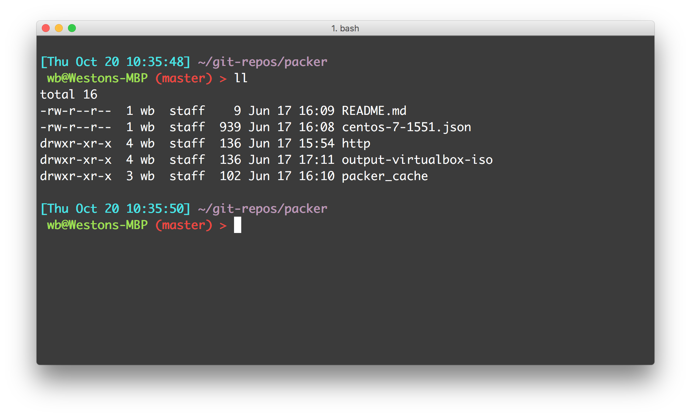

# Mac iterm profile and bash_profile

My preferred iterm profile color layout and bash profile for prompt alias etc on Mac. Includes date, time, working directory and git branch.

### Screenshot


### Installation

- Pull and down the repo
```sh
git clone https://github.com/geekbass/iterm-profile.git
```
- Open iterm and create a New Profile
- Go to Colors > Color Presets > Import > Import the iterm-profile.itermcolors file from repo
- Copy the bash prompt portion to ~/.bash_profile or mv bash_profle to ~/.bash_profile and source the profile or start a new iterm session with new profile just created.
